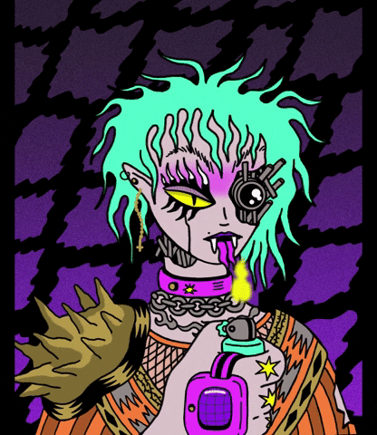

<!-- Heading & subheading -->
<h1 align="center">Hi 👋, I'm Elias</h1>
<h3 align="center">A 3D artist and a nice developer from a tiny country called Bahrain 🇧🇭</h3>

<!-- Profile Views -->

 

<!-- Links -->

<a href="https://twitter.com/teryakiisauce" target="blank">
  <!-- Twitter -->
  
</a>
<a href="https://elias-rahma-portfolio.webflow.io/" target="blank">
  <!-- GitHub Website -->
  
</a>
<a href="https://linktr.ee/teryakiisauce" target="blank">
  <!-- LinkTree -->
  
</a>

<!-- - 🔭 I’m currently working on a big project *(hint: A virtual tour game of our country Bahrain 🇧🇭 \*wink\*)*. -->

- 🔭 I have recently finished working on a game project using Unity, check it out here: **[[Bahrain Virtual Tour](https://github.com/TeryakiiSauce/Bahrain-Virtual-Tour-Game)]**.

- 🌱 I’m learning **Flutter** and **3D art** during my free time.

- 👨‍💻 One of the biggest projects I have worked on is a game called: **[Magnet Mill](https://github.com/TeryakiiSauce/Magnet-Mill-Game)**. All of my other projects/ repos are available at the "[Repositories](https://github.com/TeryakiiSauce?tab=repositories)" tab

- 💬 Ask me stuff about **Blender (3D Software), designing & programming**, I am interested!

- 📫 How to reach me: **Instagram, Twitter or LinkedIn**

- ⚡ Fun fact: **I learn & explore Blender (3D modeling software) whenever I have free time. I also watch Anime & play games. And other times I usually try to learn something new that is related to programming**.

<!-- Connections -->
<h3 align="left">Connect with me:</h3>

 

<!-- Languages or Software I Know/ Use -->
<h3 align="left">Languages and Tools:</h3>

                     <a href="https://www.gnu.org/software/bash/" target="_blank" rel="noreferrer">   </a>     

 

<!-- Image & it's sauce -->

  
   
  <figurecaption>Sauwce: <em><a href="https://giphy.com/gifs/fire-cyberpunk-cyborggirl-e7sfQlKCL4UHOpDeIn">Malondra_Gifs</a></em> On Giphy <strong>(@malondra)</strong></figurecaption>

 

<!-- Misc -->
<h1 align="center">Statistics</h1>

&nbsp;

<!-- <h3 align="center">I just do whatever I want whenever I feel like it... Thank you ^-^</h3> -->

<!---
TeryakiiSauce/TeryakiiSauce is a ✨ special ✨ repository because its `README.md` (this file) appears on your GitHub profile.
You can click the Preview link to take a look at your changes.
--->
